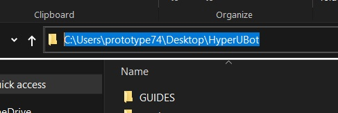
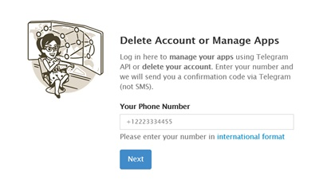
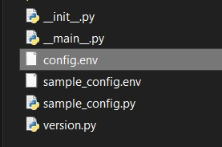
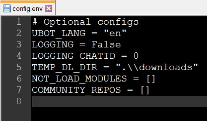
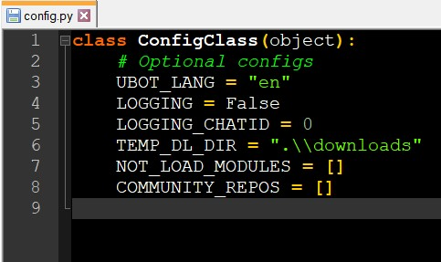
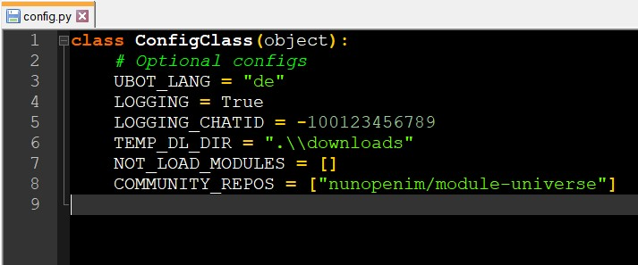

# HyperUBot Guide - Set up in Windows
## 0. Pre-requisites

Before we start, make sure you are running Windows 10, as only Windows 10 is supported. This has only been done in Windows 10 2004 too, so it is recommended to use that version only.

**Attention:** This guide is for setting up the bot in Windows PowerShell, if you are looking to set it up using WSL (Windows Subsystem for Linux), we recommend a Debian Based Distro, and the guide for those can be found [here](https://github.com/prototype74/HyperUBot/blob/master/GUIDES/SETUP_DebianBasedLinux.md).

The bot in Windows requires 5 main components:
 - Python 3.8 or newer (download from [Microsoft Store](https://www.microsoft.com/en-us/p/python-38/9mssztt1n39l) or [Python website](https://www.python.org/downloads/))
 - The Scoop Package Manager for Windows (For the extra packages - [link and instructions here](https://scoop.sh/))
 - [Git for Windows](https://git-scm.com/) (Install it with the default values, should be enough)
 - [Notepad++](https://notepad-plus-plus.org/downloads/) or [Atom](https://atom.io/)
 - [7zip](https://www.7-zip.org/) or similar unzipper app

After having these 5 components set up, you will need to install the following extra packages with scoop
- Git (required for Neofetch)
- Neofetch
- FFmpeg
- FLAC

To do such, start PowerShell (`Start > search for "PowerShell" > open it` or `hover above Start > right mouse click > open "Windows PowerShell"`) and run the command:

`scoop install git neofetch ffmpeg-shared flac`

If everything went well, you should be ready for the next step!

## 1. Download HyperUBot

After having the needed packages installed, you will need to download and extract the bot's package from the GitHub release section.
Get the latest release from here: https://github.com/prototype74/HyperUBot/releases/latest

Make sure you download it as ZIP `Source code(zip)`


Now create a new folder and name it `HyperUBot`. It doesn't matter where you create the folder on your machine but still it is recommended to keep it somewhere in `C:\Users\YourPCname\` or `C:\Users\YourPCname\Desktop` to find it easier later

Find the downloaded ZIP package and extract it's contents to `HyperUBot` folder. **Important: Make sure you just extract the contents from the root directory (should be named as `HyperUBot-vX.X.X` or `nunopenim-HyperUBot-XXXXXX`) inside the ZIP and not the root directory itself as we just need the contents inside the root directory**:


In PowerShell change the directory to `HyperUBot`. To do so copy the whole path from Windows Explorer where `HyperUBot` is located



Now change to it's directory using `cd` command in PowerShell

e.g. `cd C:\Users\YourPCname\Desktop\HyperUBot`

## 2. Setup HyperUBot

You can set up HyperUBot using it's own Setup Assistant (recommended) or doing it manually by creating the required configuration file and an optional configuration file using Notepad++ or Atom and installing the pip requirements.

### 2.1 HyperUBot's Setup Assistant (recommended for beginners)

The Setup Assistant guides you through all required processes to run HyperUBot properly on Windows such as creating the configuration file and installing the pip requirements automatically.
Run the following command to start the Setup Assistant:

`python setup.py`


**Jump to Step [3. Running the bot!](#3-running-the-bot) if Setup Assistant was completed successfully**

### 2.2 Setup HyperUBot manually (for advanced users)

To set up HyperUBot manually you need to follow the following steps:

- Installing the required pip packages
- Generating a String Session using generate_session.py script
- Create your secured configuration file
- Creating an optional configuration file (config.env or config.py)

### 2.2.1 Installing the pip packages

In HyperUBot's main directory, run the following command:

`python -m pip install -r requirements.txt`


This should install all the bot's requirements. After this command is done, and if it ran well, you are ready to advance to #2.2.2.

### 2.2.2 Get your API Key and API Hash

These 2 values mentioned in the title above are required in order to run an userbot at all. To get the `API Key` and `API Hash` values, you will need to login to [My Telegram](https://my.telegram.org/).



Here you can create an App, in the API Development Tools page.
After creating an App, your will need the `App api_id` value, and the `App api_hash` for generating a `String session` and for your
secure configuration.


IMPORTANT: **Don't share these values with anyone!**

### 2.2.3 Generate a String session

We have included, in the root folder of the userbot, a python script to generate a `String session` by using the values you got before.
This is required in order to run HyperUBot properly. To do such, you can run the command:

`python generate_session.py`

It will ask you for your phone number the login code message and probably for your accounts password.

> This all sounds very... yeah suspicious but we guarantee you that we are not collecting any data. The only purpose of this is to allow HyperUBot to login into your acoount. If you still think this all is suspicious, you're free to review the whole source code (which is why we made it publicly viewable)

After you generated your `String session`, you may got a long string, keep it safe, you will need it for the next step.

### 2.2.4 Create your secure configuration

As you probably thought already this step will create a secured configuration of your `App api_id`, `App api_hash` and your previously
generated `String session` to keep them safe from unauthorized access. To finally create your secure config, run the following command:

`python update_secure_cfg.py`

It will ask you for your `API Key`, `API Hash` and your `String session`. Optionally you can also setup a password to additionally protect your secure config, however HyperUBot will ask you each time for the password at start if you setting up one.

> If you forgot your password, you will have to create a new secure config!

### 2.2.5 Create an optional configuration file (yes this step is optional)

The bot can additionally load a config file, either `.env` or `.py`. You can find the sample configs inside `userbot` directory of HyperUBot. Sample configs are **NOT** to be used and just serves as demonstration files, with descriptions of the supported fields.
Some modules downloaded from community repos might require you to add extra configuration fields or classes for them to properly work!

### 2.2.5-1 Setup config using ENV

Locate to `userbot` directory of `HyperUBot` using Windows Explorer. In Windows Explorer tab on "View" and set a check to "File name extentions" to see the extentions of all files. Now __right click > New > Text document__ and rename `New Text Document.txt` to `config.env`. Windows will pop up a warning that you're sure you want to edit the file's name extention. Hit `Yes`. **Make sure the file extention does actually end with `.env`**



Now open `config.env` with Notepad++ or Atom and copy the template below in your config file

```
# Optional configs
UBOT_LANG = "en"
LOGGING = False
LOGGING_CHATID = 0
TEMP_DL_DIR = ".\\downloads"
NOT_LOAD_MODULES = []
COMMUNITY_REPOS = []
```



### 2.2.5-2 Setup config using py script

Locate to `userbot` directory of `HyperUBot` using Windows Explorer. In Windows Explorer tab on "View" and set a check to "File name extentions" to see the extentions of all files. Now __right click > New > Text document__ and rename `New Text Document.txt` to `config.py`. Windows will pop up a warning that you're sure you want to edit the file's name extention. Hit `Yes`. **Make sure the file extention does actually end with `.py`**


Now open `config.py` with Notepad++ or Atom and copy the template below in your config file

```python
class ConfigClass(object):
    # Optional configs
    UBOT_LANG = "en"
    LOGGING = False
    LOGGING_CHATID = 0
    TEMP_DL_DIR = ".\\downloads"
    NOT_LOAD_MODULES = []
    COMMUNITY_REPOS = []
```




Save it, by doing **Ctrl + S** or **File > Save**

> Note: Only one config file, either `config.env` or `config.py`, should be configured in `userbot` directory.
If both are configured there, then only `config.env` will be loaded.

### 2.2.5.1 Logging, Language and Community Repos (optional)

Setting up logging is easy, all you need is a designated log group **(Do not use public groups, or you could be banned for spam!)**.
Having the log group, you need to find it's ID. You can do such by using a Group Manager Bot,
or if your userbot is working already, by the .chatinfo command.
Copy this ID and put it in the `LOGGING_CHATID` field e.g `LOGGING_CHATID = -100123456789`,
then set `LOGGING` config to `True`. That's it!

To set up a language, you will need to change the `UBOT_LANG` config,
to any of the supported languages inside `translations` directory.
Just replace `en` by any other language code (no need to include the .py part of the file).

Community repos are also easy to set up. All you need is the name of the repository and the author,
in GitHub. Then add it, between "", to between the [] in the `COMMUNITY_REPOS` field.
If you need to add more repositories, separate them by commas (for example ["nunopenim/repo1", "nunopenim/repo2"]).



## 3. Running the bot!

If your configuration is valid, and everything has been set-up correctly, you are ready to start!
Do such by running the following command in PowerShell:

`python -m userbot`

If you see this message below in terminal

`I: userbot: You're running HyperUBot vX.X.X as [your Telegram name] (ID: 123456789)`

then congratulations! You successfully did setup HyperUBot on Windows!


Enjoy HyperUBot and have fun!
